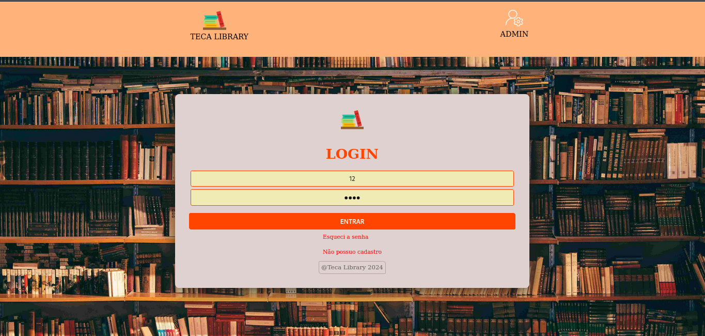
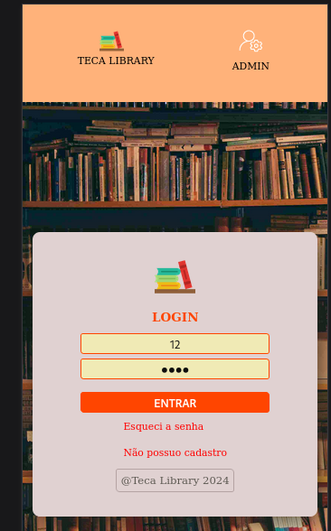
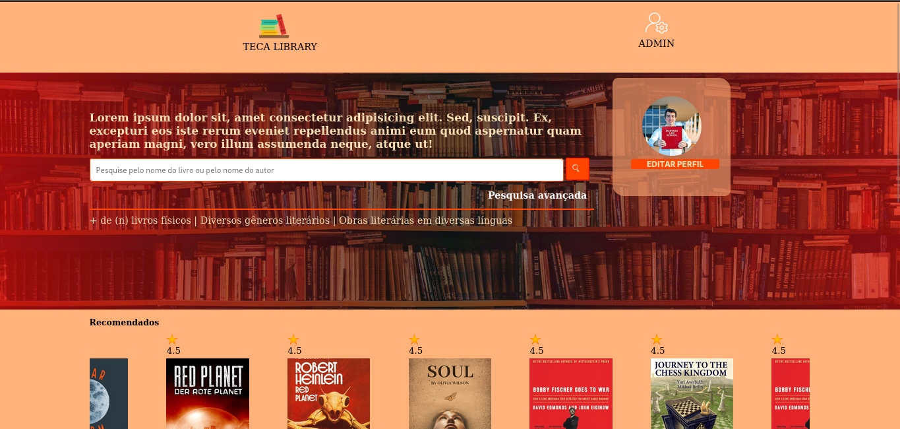
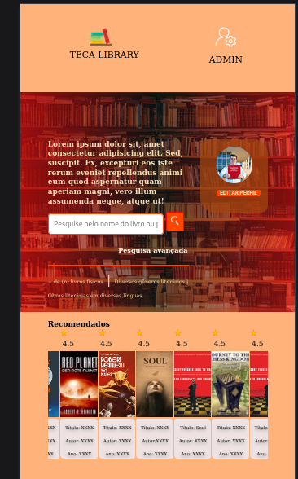

# TECA LIBRARY

Protótipo do Front-end da Teca Library, um projeto da disciplina de Engenharia de Software, referente ao terceiro (3º) período do curso de ADS do Instituto Federal do Tocantins.

### Alunos: Adelson Teodoro, Arthur Duarte,Keyton Bessa, Sávio Vitor e Victor Ferraz.

## INDICE
- <a href="#requisitos">REQUISITOS</a>
- <a href="#tecnologias">TECNOLOGIAS</a>
- <a href="#layouts">LAYOUTS</a>

## REQUISITOS
#### FUNCIONAIS:
- [x] Cadastro de livros
- [x] Empréstimo de livros
- [x] Login e senha 
- [x] Cashback
- [x] Sistema de avaliação de livros
- [x] Sistema de estatística de leitura
- [x] Limite de aluguel de livros

#### NÃO FUNCIONAIS:

- [x] Cores: Utilizar as cores laranja e branco no design do sistema.
- [x] Layout arrastável: Adicionar funcionalidade para indicar que o layout pode ser arrastado horizontalmente (Carousel).
- [x] Responsividade
- [x] Acessibilidade

## TECNOLOGIAS

     
      

          

## LAYOUTS 

 Login Desktop: 

 Login Mobile: 

 User area Desktop: 

 User area mobile: 

